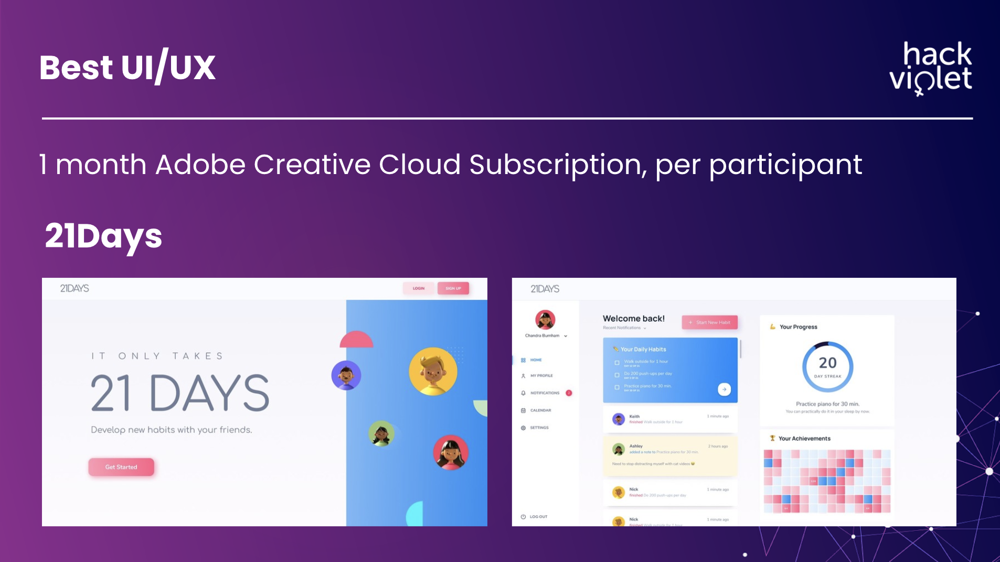

# 21Days - Hackathon Project for 
_Awarded **Best UI/UX** of 150+ projects_

Team members: , , 

 |  |  | 

21Days is a real-time _collaborative_ habit-tracker web app enabling ambitious people to pursue new habits in a team-oriented way. Share your latest ambition and pursue new habits alongside the support of your friends. What will you achieve in 21Days? 

### 💡  Inspiration
They say it is a myth that you can start a new habit on your own in only 21 days. But wouldn't this be so much more achievable with the support and motivation of your community? Compounded by isolation induced by the ongoing pandemic, our team strove to seek a solution for motivating people towards self-improvement by bringing together friends to pursue new habits together. Inspired by bullet journaling, friends can also exchange notes in real-time about their experiences with this habit on a bulletin board.

### 🔨  How we built it
The prototype was designed in Figma. We implemented a demo of 21Days' functionality in React and Firebase.

### 🧩  Challenges we ran into
A biggest challenge to this project was definitely the learning curve with React and Firebase. A sizable amount of time was spent on reading up how to utilize Firebase's Realtime Database and integrating it with our web app. Additionally, we had a bug where the checkmark's 'click space' (the area where you can click the checkmark) was much larger than the actual checkmark, which interfered with other features on the page. The checkmark was from an existing React API, so it was definitely a new experience and a challenge to figure out why the checkmark was not acting the way we wanted it to.

### 🎊  Accomplishments that we're proud of
We were successful in implementing the live bulletin-board feature for friends to share their experiences, and learned how to integrate Firebase's realtime database in React applications. Our web app's interface and features are far from where we want them to be, but for our first React app done in one day, we are still proud of what we've created.

### 🧠  What we learned
This was the first time we've worked with Firebase and Google Authentication, so much of our time was spent grappling with these technologies. We learned a lot about the existing APIs for React and how to use them as well. Although the web-app has a long way to go from the prototype we've designed, we learned a great deal and are excited to continue developing our ideas even after the hackathon concludes.
